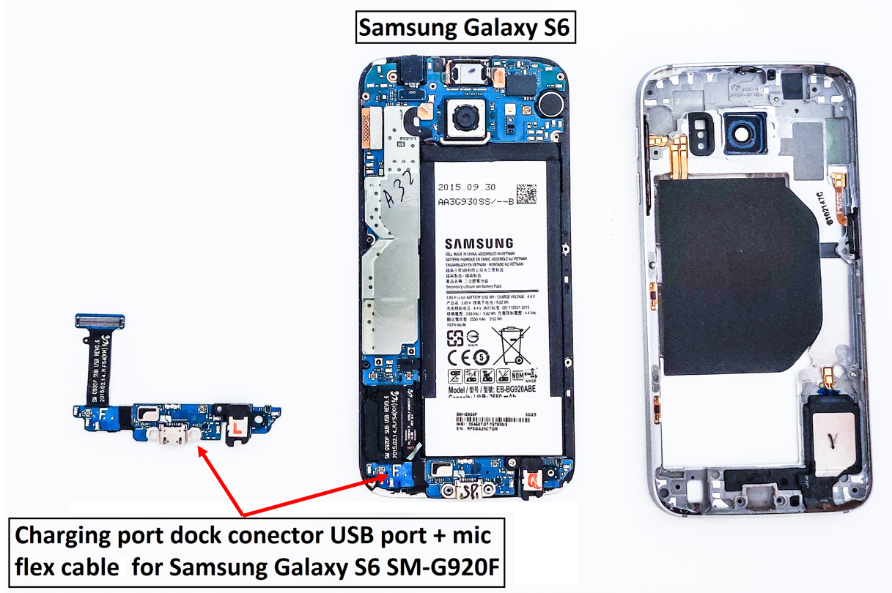
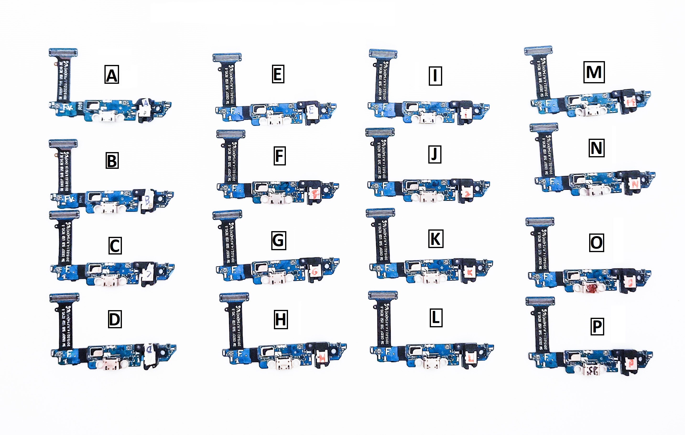

# Microphone Fingerprint dataset
Details for a Microphone Fingerprint dataset used for smartphone fingerprinting based on their microphone characteristics. 
For a similar dataset containing loudspeaker data for device fingerprinting please see: 
https://github.com/AdrianaBerdich/Sweep-to-Unlock-Datasets 

# Fingerprinting Smartphones Based on Microphone Characteristics from Environment Affected Recordings

Abstract: Fingerprinting devices based on unique characteristics of their sensors is an important research direction nowadays due to its immediate impact on non-interactive authentications and no less due to privacy implications. In this work, we investigate smartphone fingerprints obtained from microphone data based on recordings containing human speech, environmental sounds and several live recordings performed outdoors. We record a total of 19,200 samples using distinct devices as well as identical microphones placed on the same device in order to check the limits of the approach. To comply with real-world circumstances, we also consider the presence of several types of noise that is specific to the scenarios which we address, e.g., traffic and market noise at distinct volumes, and may reduce the reliability of the data.  
We analyze several classification techniques based on traditional machine learning algorithms and more advanced deep learning architectures that are put to test in recognizing devices from the recordings they made. The results indicate that the classical Linear  Discriminant classifier and a deep-learning Convolutional Neural Network have comparable success rates while outperforming all the rest of the classifiers. 

# 1. Concept
We explored smartphone microphone fingerprinting based on microphone data by using the power spectrum of the recorded signal. 
We record two major use cases of fingerprinting based on synthetically reproduced environmental sound and finally live recordings. In all the scenarios, noise was added to make identification more challenging.
        


# 2. Dataset
Dataset content The dataset is structured as described below. We provide the clean recordings as audio data (PCM or WAV) as well as the power spectrum (FFT as .txt). For recordings affected by noise, we provide only the FFT results (as .txt).

## Summary of devices and associated measurements ##


 No. | Phones | Label  | No. | Msr.   | Total   
---- | :------: | :------: | :-------: | :--------: | :------
1 |	Samsung Galaxy S6	| A to P |	16	| 200	| 3200
2 |	Samsung Galaxy S6 (others)|	S6 and S6'	|2	|1000	|2000
3 |	Allview V1 Viper I	|AV	|1|	1000|	1000
4 |	Samsung Galaxy J5	|J5, J5' and J5''	|3|	1000|	3000
5 |	One Plus 7 Pro	|OP|	1	|1000|	1000
6 |	Samsung Galaxy Tab S7	|S7t|	1	|1000	|1000
7 |	Leagoo Z10|	LE and LE'|	2	|1000|	2000
8 |	Samsung Galaxy A21s	|A21|	1	|1000|	1000
9 |	Samsung Galaxy Tab S7|	S7|	1|	1000|	1000
10 |	Motorola E6 Plus	| MT|	1|	1000|	1000
11 |	Google Nexus 7|	N7|	1|	1000 | 1000
12 |	LG Optimus P700	| LG|	1	|1000|	1000
 &nbsp;|	Total	| 	|&nbsp;|32|	 19200|
 
 
 

## Folder structure ##
RAW RECORDINGS  (folder, 131 files) \
|------ Clean recordings identical microphones (Samsung S6)   \
|&nbsp;&nbsp;&nbsp;&nbsp;&nbsp;&nbsp;&nbsp;&nbsp;|------ barrier \
|&nbsp;&nbsp;&nbsp;&nbsp;&nbsp;&nbsp;&nbsp;&nbsp;&nbsp;&nbsp;&nbsp;&nbsp;&nbsp;&nbsp;&nbsp;&nbsp;|------ microphones A to P (16 microphones x 50 samples) \
|&nbsp;&nbsp;&nbsp;&nbsp;&nbsp;&nbsp;&nbsp;&nbsp;|------ car \
|&nbsp;&nbsp;&nbsp;&nbsp;&nbsp;&nbsp;&nbsp;&nbsp;&nbsp;&nbsp;&nbsp;&nbsp;&nbsp;&nbsp;&nbsp;&nbsp;|------ microphones A to P (16 microphones x 50 samples) \
|&nbsp;&nbsp;&nbsp;&nbsp;&nbsp;&nbsp;&nbsp;&nbsp;|------ horn \
|&nbsp;&nbsp;&nbsp;&nbsp;&nbsp;&nbsp;&nbsp;&nbsp;&nbsp;&nbsp;&nbsp;&nbsp;&nbsp;&nbsp;&nbsp;&nbsp;|------ microphones A to P (16 microphones x 50 samples) \
|&nbsp;&nbsp;&nbsp;&nbsp;&nbsp;&nbsp;&nbsp;&nbsp;|------ loc \
|&nbsp;&nbsp;&nbsp;&nbsp;&nbsp;&nbsp;&nbsp;&nbsp;&nbsp;&nbsp;&nbsp;&nbsp;&nbsp;&nbsp;&nbsp;&nbsp;|------ microphones A to P (16 microphones x 50 samples) \
|------ Clean recordings distinct microphones (16 phones x 300, 300 and 400 samples) \
|&nbsp;&nbsp;&nbsp;&nbsp;&nbsp;&nbsp;&nbsp;&nbsp;|------ hazard lights \
|&nbsp;&nbsp;&nbsp;&nbsp;&nbsp;&nbsp;&nbsp;&nbsp;&nbsp;&nbsp;&nbsp;&nbsp;&nbsp;&nbsp;&nbsp;&nbsp;|------ 16 disctinct smartphones x 300 samples \
|&nbsp;&nbsp;&nbsp;&nbsp;&nbsp;&nbsp;&nbsp;&nbsp;|------ wipers \
|&nbsp;&nbsp;&nbsp;&nbsp;&nbsp;&nbsp;&nbsp;&nbsp;&nbsp;&nbsp;&nbsp;&nbsp;&nbsp;&nbsp;&nbsp;&nbsp;|------ 16 disctinct smartphones x 300 samples \
|&nbsp;&nbsp;&nbsp;&nbsp;&nbsp;&nbsp;&nbsp;&nbsp;|------ horn \
|&nbsp;&nbsp;&nbsp;&nbsp;&nbsp;&nbsp;&nbsp;&nbsp;&nbsp;&nbsp;&nbsp;&nbsp;&nbsp;&nbsp;&nbsp;&nbsp;|------ 16 disctinct smartphones x 400 samples

Dataset Download Link: [RAW_RECORDINGS.7z](https://uptro29158-my.sharepoint.com/:u:/g/personal/adriana_berdich_student_upt_ro/Ee7MeOXTCudPoeROuw3j250BwbYDYBF41nGNAa1GTglbBg?e=TjtKeU)  (2.9GB) or [RAW_RECORDINGS.7z](http://www.aut.upt.ro/~bgroza/projects/mic-fprint/RAW_RECORDINGS.7z)  (2.9GB)  

|------ Clean recordings  \
|&nbsp;&nbsp;&nbsp;&nbsp;&nbsp;&nbsp;&nbsp;&nbsp;|------- live recordings \
|&nbsp;&nbsp;&nbsp;&nbsp;&nbsp;&nbsp;&nbsp;&nbsp;&nbsp;&nbsp;&nbsp;&nbsp;&nbsp;&nbsp;&nbsp;&nbsp;|------- hazard lights (300 recordings with 16 distinct smartphones) \
|&nbsp;&nbsp;&nbsp;&nbsp;&nbsp;&nbsp;&nbsp;&nbsp;&nbsp;&nbsp;&nbsp;&nbsp;&nbsp;&nbsp;&nbsp;&nbsp;&nbsp;&nbsp;&nbsp;&nbsp;&nbsp;&nbsp;&nbsp;&nbsp;|------ 16 disctinct smartphones x 400 samples \
|&nbsp;&nbsp;&nbsp;&nbsp;&nbsp;&nbsp;&nbsp;&nbsp;&nbsp;&nbsp;&nbsp;&nbsp;&nbsp;&nbsp;&nbsp;&nbsp;|------- wipers (300 recordings with 16 distinct smartphones) \
|&nbsp;&nbsp;&nbsp;&nbsp;&nbsp;&nbsp;&nbsp;&nbsp;&nbsp;&nbsp;&nbsp;&nbsp;&nbsp;&nbsp;&nbsp;&nbsp;&nbsp;&nbsp;&nbsp;&nbsp;&nbsp;&nbsp;&nbsp;&nbsp;|------ 16 disctinct smartphones x 400 samples \
|&nbsp;&nbsp;&nbsp;&nbsp;&nbsp;&nbsp;&nbsp;&nbsp;&nbsp;&nbsp;&nbsp;&nbsp;&nbsp;&nbsp;&nbsp;&nbsp;|------- car honk (400 recordings with 16 distinct smartphones) \
|&nbsp;&nbsp;&nbsp;&nbsp;&nbsp;&nbsp;&nbsp;&nbsp;&nbsp;&nbsp;&nbsp;&nbsp;&nbsp;&nbsp;&nbsp;&nbsp;&nbsp;&nbsp;&nbsp;&nbsp;&nbsp;&nbsp;&nbsp;&nbsp;|------ 16 disctinct smartphones x 400 samples \
|&nbsp;&nbsp;&nbsp;&nbsp;&nbsp;&nbsp;&nbsp;&nbsp;|------- synthetically reproduced environmental sounds \
|&nbsp;&nbsp;&nbsp;&nbsp;&nbsp;&nbsp;&nbsp;&nbsp;&nbsp;&nbsp;&nbsp;&nbsp;&nbsp;&nbsp;&nbsp;&nbsp;|------- 0 22kHz barrier (50 recordings with 16 identical smartphones) \
|&nbsp;&nbsp;&nbsp;&nbsp;&nbsp;&nbsp;&nbsp;&nbsp;&nbsp;&nbsp;&nbsp;&nbsp;&nbsp;&nbsp;&nbsp;&nbsp;&nbsp;&nbsp;&nbsp;&nbsp;&nbsp;&nbsp;&nbsp;&nbsp;|------ microphones A to P (16 microphones x 50 samples) \
|&nbsp;&nbsp;&nbsp;&nbsp;&nbsp;&nbsp;&nbsp;&nbsp;&nbsp;&nbsp;&nbsp;&nbsp;&nbsp;&nbsp;&nbsp;&nbsp;|------- 0 22kHz car (50 recordings with 16 identical smartphones) \
|&nbsp;&nbsp;&nbsp;&nbsp;&nbsp;&nbsp;&nbsp;&nbsp;&nbsp;&nbsp;&nbsp;&nbsp;&nbsp;&nbsp;&nbsp;&nbsp;&nbsp;&nbsp;&nbsp;&nbsp;&nbsp;&nbsp;&nbsp;&nbsp;|------ microphones A to P (16 microphones x 50 samples) \
|&nbsp;&nbsp;&nbsp;&nbsp;&nbsp;&nbsp;&nbsp;&nbsp;&nbsp;&nbsp;&nbsp;&nbsp;&nbsp;&nbsp;&nbsp;&nbsp;|------- 0 22kHz horn (50 recordings with 16 identical smartphones) \
|&nbsp;&nbsp;&nbsp;&nbsp;&nbsp;&nbsp;&nbsp;&nbsp;&nbsp;&nbsp;&nbsp;&nbsp;&nbsp;&nbsp;&nbsp;&nbsp;&nbsp;&nbsp;&nbsp;&nbsp;&nbsp;&nbsp;&nbsp;&nbsp;|------ microphones A to P (16 microphones x 50 samples) \
|&nbsp;&nbsp;&nbsp;&nbsp;&nbsp;&nbsp;&nbsp;&nbsp;&nbsp;&nbsp;&nbsp;&nbsp;&nbsp;&nbsp;&nbsp;&nbsp;|------- 0 22kHz loc (50 recordings with 16 identical smartphones) \
|&nbsp;&nbsp;&nbsp;&nbsp;&nbsp;&nbsp;&nbsp;&nbsp;&nbsp;&nbsp;&nbsp;&nbsp;&nbsp;&nbsp;&nbsp;&nbsp;&nbsp;&nbsp;&nbsp;&nbsp;&nbsp;&nbsp;&nbsp;&nbsp;|------ microphones A to P (16 microphones x 50 samples) \
|------- Recordings affected by noise \
|&nbsp;&nbsp;&nbsp;&nbsp;&nbsp;&nbsp;&nbsp;&nbsp;|------- live recordings \
|&nbsp;&nbsp;&nbsp;&nbsp;&nbsp;&nbsp;&nbsp;&nbsp;&nbsp;&nbsp;&nbsp;&nbsp;&nbsp;&nbsp;&nbsp;&nbsp;|------- hazard lights music (300 recordings with 16 distinct smartphones) \
|&nbsp;&nbsp;&nbsp;&nbsp;&nbsp;&nbsp;&nbsp;&nbsp;&nbsp;&nbsp;&nbsp;&nbsp;&nbsp;&nbsp;&nbsp;&nbsp;&nbsp;&nbsp;&nbsp;&nbsp;&nbsp;&nbsp;&nbsp;&nbsp;|------ 16 disctinct smartphones x 400 samples \
|&nbsp;&nbsp;&nbsp;&nbsp;&nbsp;&nbsp;&nbsp;&nbsp;&nbsp;&nbsp;&nbsp;&nbsp;&nbsp;&nbsp;&nbsp;&nbsp;|------- wipers music (300 recordings with 16 distinct smartphones) \
|&nbsp;&nbsp;&nbsp;&nbsp;&nbsp;&nbsp;&nbsp;&nbsp;&nbsp;&nbsp;&nbsp;&nbsp;&nbsp;&nbsp;&nbsp;&nbsp;&nbsp;&nbsp;&nbsp;&nbsp;&nbsp;&nbsp;&nbsp;&nbsp;|------ 16 disctinct smartphones x 400 samples \
|&nbsp;&nbsp;&nbsp;&nbsp;&nbsp;&nbsp;&nbsp;&nbsp;&nbsp;&nbsp;&nbsp;&nbsp;&nbsp;&nbsp;&nbsp;&nbsp;|------- car honk music (400 recordings with 16 distinct smartphones) \
|&nbsp;&nbsp;&nbsp;&nbsp;&nbsp;&nbsp;&nbsp;&nbsp;&nbsp;&nbsp;&nbsp;&nbsp;&nbsp;&nbsp;&nbsp;&nbsp;&nbsp;&nbsp;&nbsp;&nbsp;&nbsp;&nbsp;&nbsp;&nbsp;|------ 16 disctinct smartphones x 400 samples

Dataset Download Link: [FFT_EXTRACTIONS.7z](https://uptro29158-my.sharepoint.com/:u:/g/personal/adriana_berdich_student_upt_ro/EXxd2dt03opLk0EX2XjHfXIByQYrr7zBQIBL0K7Qd_IC1w?e=tF8jGB) (479.2MB) or  [FFT_EXTRACTIONS.7z]( http://www.aut.upt.ro/~bgroza/projects/mic-fprint/FFT_EXTRACTIONS.7z) (479.2MB) 

Note that the RAW files are very large and uncut, it is advisable that you use the FFT extractions.

##File structure##
The RAW RECORDINGS folder contains the clean recordings as audio data. 
For clean recordings with distinct microphones we used PCM files, each file contains slightly over 300 records (for hazard lights), 300 records (for wipers) and 400 records (for car honk). 
For clean recordings with identical microphones we used WAV amd PCM files, each file contains slightly over 50 records for barrier, car, horn and locomotive sounds. 
			     
The FFT EXTRACTIONS folder contains the power spectrum of the recorded signals.
For each sample we build a .TXT file which contains two columns, the first column represents the frequency and the second is the amplitude of the power spectrum for the specific frequency. 
There are 4096 lines in each file which represent the amplitudes of the power spectrum between 0Hz and 22050Hz at ~5Hz resolution.

Feel free to use our dataset for research purposes by giving credit to our paper below.


# 3. Publication
A. Berdich, B. Groza, E. Levy, A. Shabtai, Y. Elovici and R. Mayrhofer "Fingerprinting Smartphones Based on Microphone Characteristics from Environment Affected Recordings ", IEEE Access.


```
@article{BerdichGLSEM
title={Fingerprinting Smartphones Based on Microphone Characteristics from Environment Affected Recordings }, 
author={Berdich, Adriana and Groza, Bogdan and Levy, Efrat and Shabtai, Asaf and Elovici, Yuval and Mayrhofer, Rene},
journal={IEEE Access}, 
year={2022}, 
publisher={IEEE} 
}
```

 # 4. Contact
For any questions about our work and dataset, don't hesitate to contact us (adriana.berdich at aut.upt.ro or bogdan.groza at aut.upt.ro).
